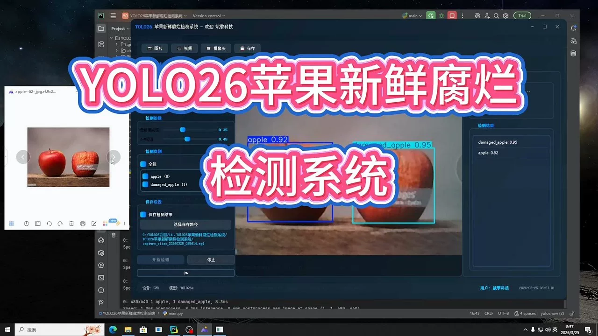
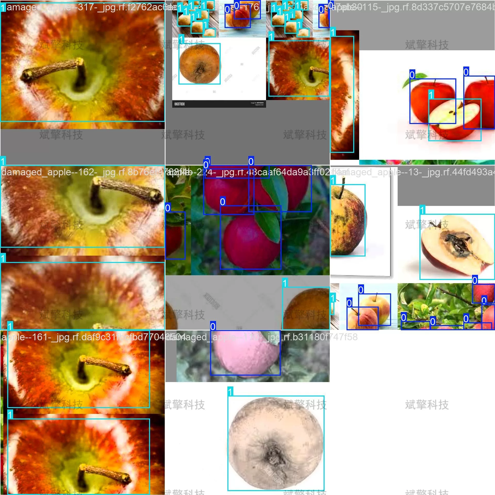
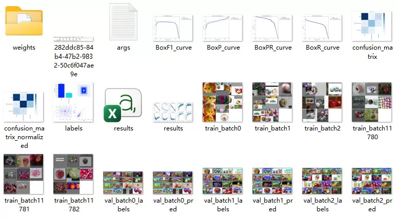
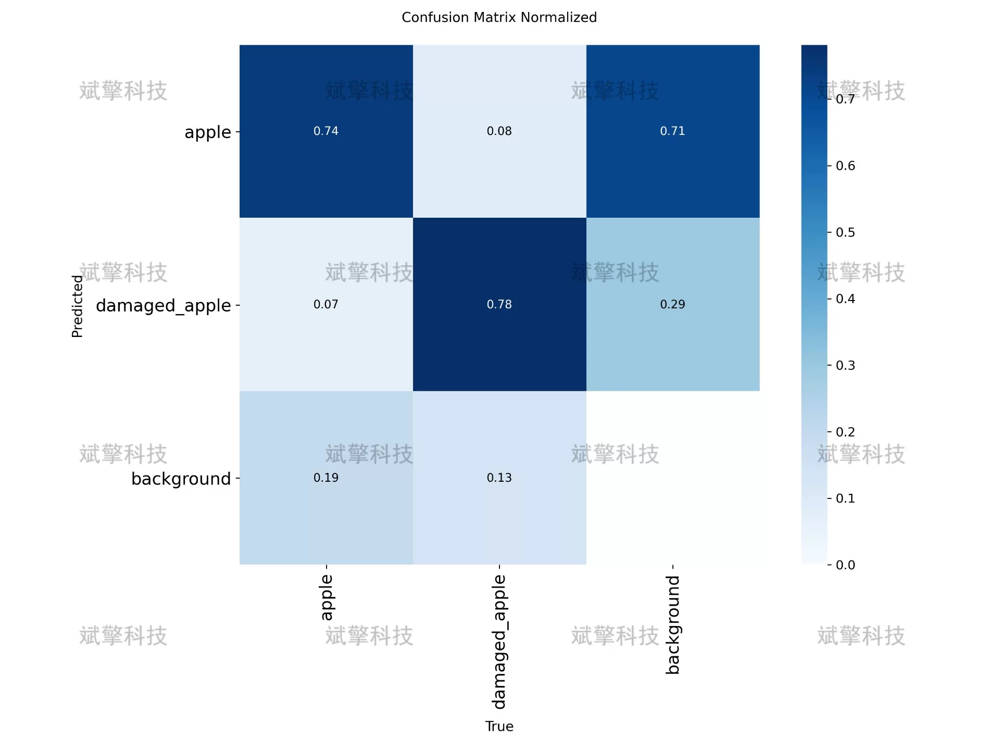
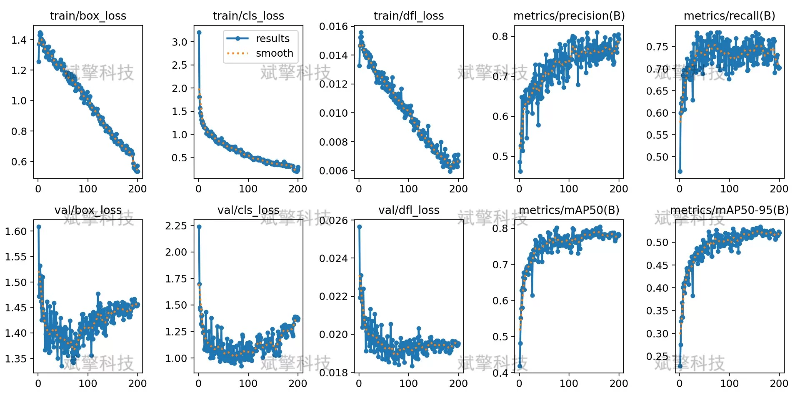
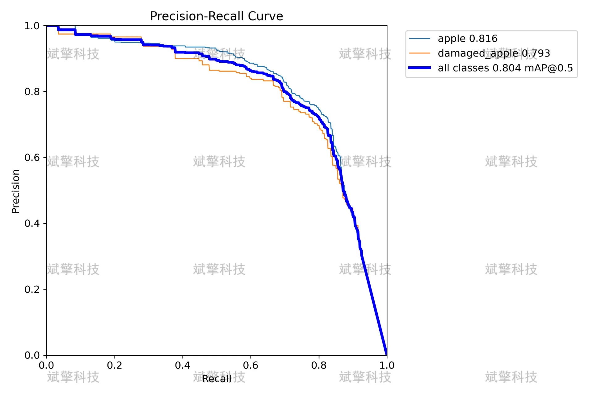
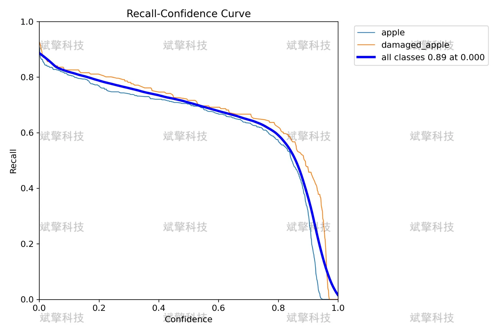
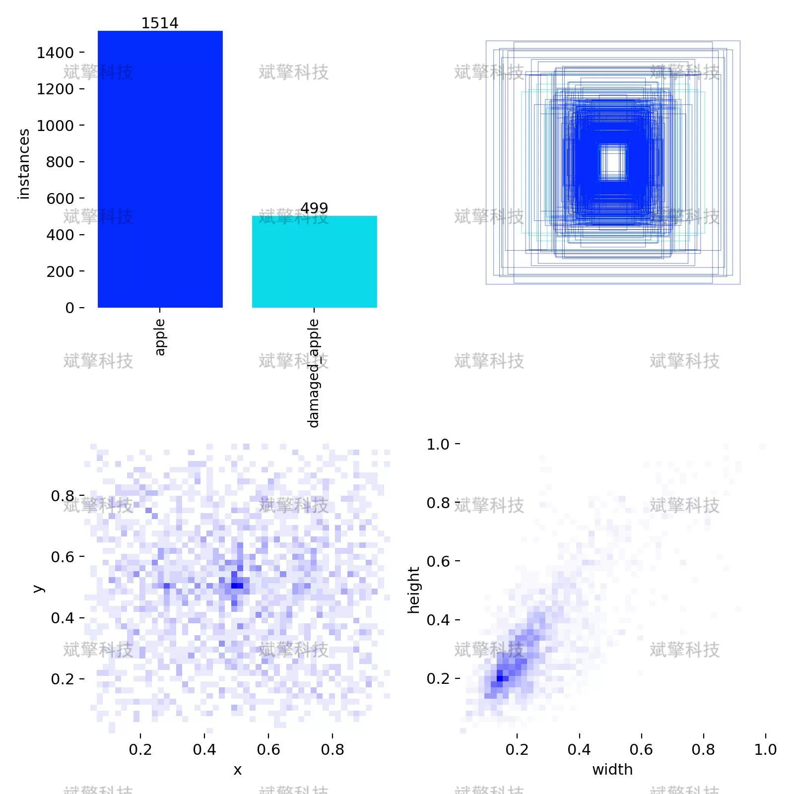
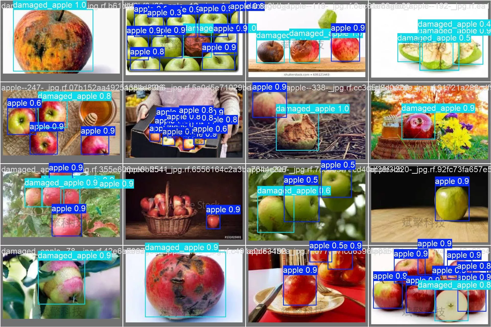

# YOLOv26 Apple Fresh Rot Detection System | Dataset

## Body

YOLO26 Apple Freshness and Rot Detection System | Dataset for YOLO26 Fruit Quality Inspection: Automated Detection of Fresh and Rotten Apples

This article addresses the issue of freshness and rot detection in apple quality inspection, constructing an efficient system for automatic recognition of fresh and rotten apples based on the YOLO object detection algorithm. This system provides an intelligent solution for fruit and vegetable quality assessment.
The experiment used the YOLO26 model to train and validate on a dataset consisting of 697 labeled images, including 489 training images, 178 validation images, and 30 test images. The training results show that the model achieves an mAP50 of 0.8 on the validation set, demonstrating excellent detection accuracy and generalization capabilities. Through in-depth analysis of confusion matrices and precision-recall curves, the model's feasibility and robustness in practical applications were verified.
This study provides an effective technical path for intelligent agricultural product inspection, holding significant theoretical and practical value.

Dataset Composition:
Number of categories: 2
Category names: ['apple', 'damaged_apple']
Image quantity:
Training set: 489 (70.2%)
Validation set: 178 (25.5%)
Test set: 30 (4.3%)

Free reservation for remote installation. Unsuccessful full refund.
Purchase comes with the following resources (unlocked through Baidu Cloud):
- YOLO Identification Detection Project complete source code
- YOLO format dataset
- Training code + UI interface code
- Trained model + result images
- Software installation package
- Add WeChat to make a reservation for remote installation (auto display WeChat ID after purchase) - Unsuccessful, full refund

⚙️ Core Functional Modules
Detection Capabilities
- Image detection: upload and detect, return detection boxes + category information
- Video detection: supports video files, analyzes frames accurately one by one
- Camera real-time detection: connects USB camera for dynamic monitoring
Interaction and Control
- Target selection: freely choose one or more categories for detection
- Parameter adjustment: adjustable confidence threshold & IoU threshold, flexible control of precision
- Results saving: one-click save of image/video/camera detection results
System and Data
- User login registration: supports password strength detection + encryption storage
- Log recording: automatically records operation and error information (timestamped)

## Images

## Payment

Here is a pay link on Stripe ( https://buy.stripe.com/3cs8yP7sY87d0vu9AB ). Please contact me lonlonago@foxmail.com after funding $89, and I will send you a complete data files , thank you!

